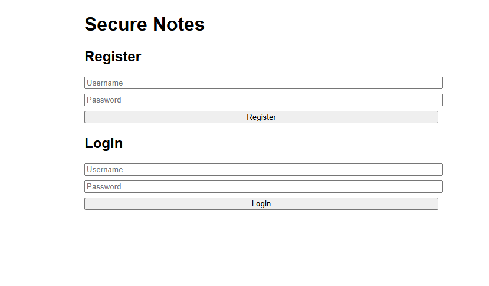
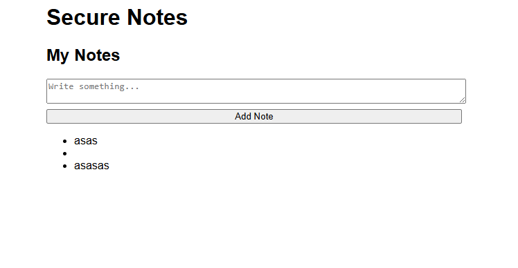
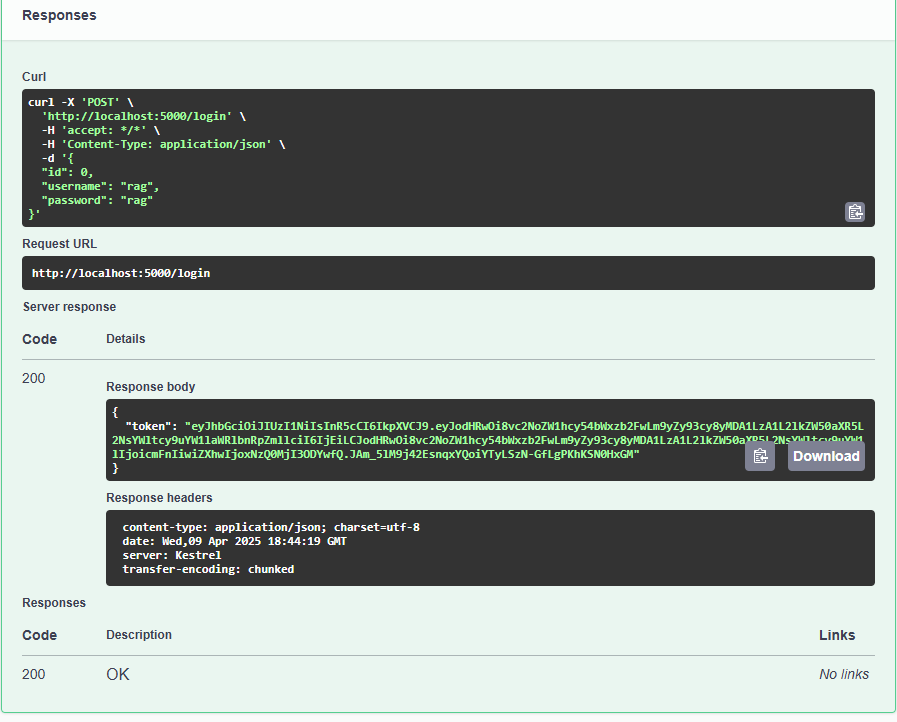
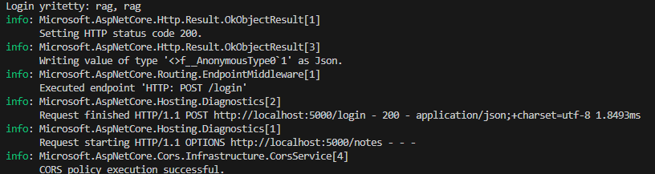

# Secure Notes API

Yksinkertainen ja turvallinen muistiinpanosovellus, jossa on ASP.NET Core -pohjainen Web API, JWT-autentikointi ja kevyt HTML/JavaScript-frontend.

## Ominaisuudet

- Käyttäjän rekisteröinti ja kirjautuminen
- JWT-tokenin käyttö suojatuissa reiteissä
- CRUD-muistiinpanot käyttäjäkohtaisesti
- In-memory tietokanta
- Swagger UI testaukseen

##  Käyttö

### Backend (API)

```bash
dotnet restore
dotnet run
```

Käynnistyy: `http://localhost:5000`

Swagger löytyy osoitteesta:  
 `http://localhost:5000/swagger`

### Frontend

Avaa `public/index.html` selaimessa (esim. Live Server):
```
http://127.0.0.1:5500/public/index.html
```

## Rakenne

```
Program.cs              // API ja reitit
Models/                 // User & Note -mallit
Data/                   // AppDbContext
public/index.html       // Frontend UI
```

## Tarkoitus

Harjoitus- ja työnäyteprojekti, joka demonstroi C# backendin ja frontendin välistä JWT-pohjaista autentikointia.





